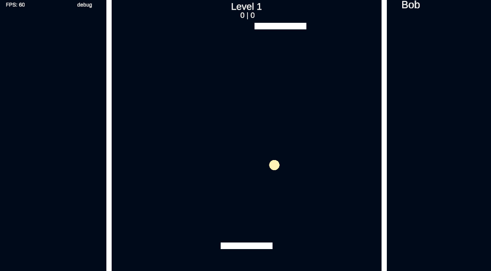
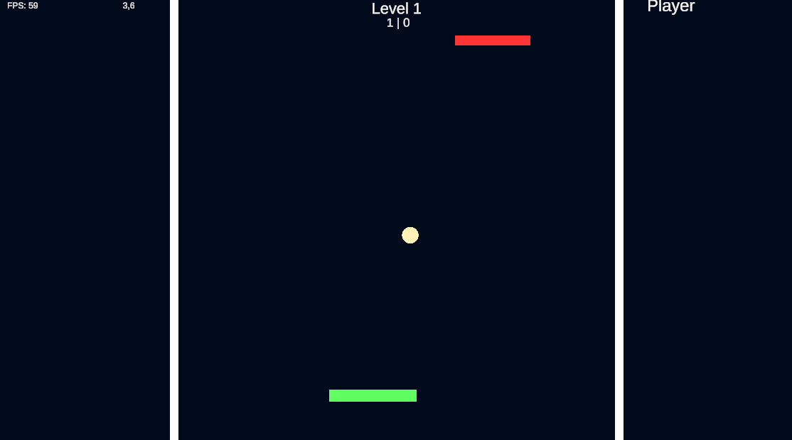
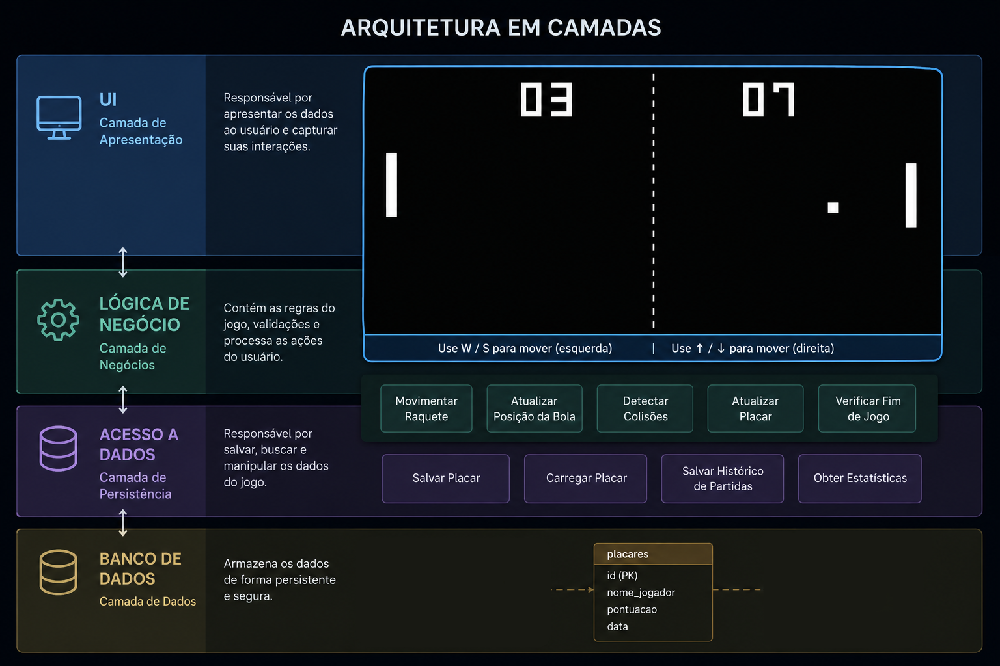

# 🏓 Pong Unity

Projeto inspirado no clássico Pong desenvolvido na Unity utilizando C#.

---

## 📖 Sobre o projeto

Este projeto recria o clássico jogo Pong em uma versão moderna, com foco em aprendizado de desenvolvimento de jogos, sistemas de pontuação, inteligência artificial e futuramente ranking online.

O jogador controla uma plataforma enquanto enfrenta uma CPU que rebate a bola automaticamente.

---

## 🎮 Gameplay



---

## ✅ Funcionalidades atuais

- Menu inicial
- Partida jogador vs CPU
- Sistema de pontuação
- Física da bola
- Tela de Game Over
- Reinício de partida

---

## 🚧 Funcionalidades futuras

- Sistema de ranking
- Login de usuários
- Multiplayer online
- Loja de melhorias
- Power-ups durante a partida
- Modo mobile (APK)

---

## 🛠️ Tecnologias utilizadas

- Unity
- C#
- Git
- GitHub

---

## 📂 Estrutura do projeto

```txt
Assets/
ProjectSettings/
Packages/
README.md
```

---

## ▶️ Como executar o projeto

1. Clone o repositório:

```bash
git clone https://github.com/SEU_USUARIO/pongGame.git
```

2. Abra o projeto na Unity

3. Execute a cena principal

---

## 📸 Screenshots

### Menu Inicial


### Gameplay



### Game Over


---

## 👨‍💻 Autor

Rodrigo Franco

GitHub:
https://github.com/RodrigoFr10

## 📖 Resumo do Projeto

Jogos digitais competitivos e casuais continuam sendo amplamente utilizados como forma de entretenimento e interação entre usuários em diferentes plataformas. A ausência de mecânicas modernas, sistemas de progressão e funcionalidades online em versões clássicas pode limitar o engajamento e a experiência dos jogadores atuais. 

Este projeto propõe o desenvolvimento de uma releitura do jogo Pong utilizando a Unity, incorporando sistemas como inteligência artificial, pontuação, ranking e possíveis funcionalidades multiplayer. Como consequência, espera-se criar uma aplicação capaz de unir a simplicidade de um jogo clássico com recursos contemporâneos de interação e competitividade digital.

# ❗ Definição do Problema

Jogos clássicos como Pong marcaram a história da indústria dos jogos digitais devido à simplicidade de suas mecânicas e facilidade de acesso por diferentes públicos. Entretanto, muitas versões atuais desses jogos mantêm apenas a proposta original, sem incorporar funcionalidades modernas capazes de aumentar a competitividade, a progressão e o engajamento dos jogadores, o que pode não prender o interesse de audiências modernas.

O desenvolvimento de jogos digitais também envolve desafios técnicos relevantes, como implementação de inteligência artificial, sistemas de pontuação, gerenciamento de estados de jogo, interfaces interativas e persistência de dados. Esses elementos são fundamentais para aproximar projetos acadêmicos das práticas utilizadas na indústria de desenvolvimento de jogos.

Durante a etapa de discovery, foi identificado que diversos jogos casuais modernos utilizam sistemas de ranking, progressão e feedback visual para ampliar o tempo de retenção e a experiência dos usuários. Também foi observado que jogos clássicos continuam sendo amplamente utilizados como base para estudos e prototipagem no desenvolvimento de jogos digitais, devido à simplicidade estrutural e ao potencial de expansão de funcionalidades.

Nesse contexto, o projeto propõe o desenvolvimento de uma releitura moderna do jogo Pong utilizando a engine Unity, incorporando recursos adicionais como inteligência artificial para oponente, sistema de pontuação, ranking local e possibilidades futuras de expansão para multiplayer e sistemas online. Dessa forma, busca-se unir conceitos clássicos de gameplay com funcionalidades contemporâneas presentes em jogos competitivos atuais.

# 🎯 Objetivos

## Objetivo Geral

Desenvolver uma releitura moderna do jogo Pong utilizando a engine Unity, incorporando mecânicas clássicas de gameplay com funcionalidades contemporâneas, como inteligência artificial, sistema de pontuação e ranking, proporcionando uma experiência interativa, competitiva e acessível aos usuários.

---

## Objetivos Específicos

- Implementar a movimentação das plataformas e da bola utilizando física 2D.
- Desenvolver um sistema de pontuação funcional durante as partidas.
- Criar uma inteligência artificial capaz de controlar o oponente.
- Implementar telas de interface, como menu inicial e tela de Game Over.
- Desenvolver um sistema de ranking local para armazenamento de pontuações.
- Estruturar o projeto de forma organizada e escalável para futuras expansões.
- Possibilitar futuras implementações, como multiplayer online, sistema de login e loja de melhorias.
- Aplicar conceitos de desenvolvimento de jogos digitais utilizando C# e Unity.
- Proporcionar uma experiência simples e intuitiva para jogadores casuais e competitivos.


# 🛠️ Stack Tecnológico

## Unity

A Unity será utilizada como engine principal para o desenvolvimento do jogo. A plataforma oferece suporte ao desenvolvimento de jogos 2D e 3D, accessibilidade com versões gratuitas, além de disponibilizar ferramentas integradas para física, animação, interface gráfica e gerenciamento de cenas. Sua ampla documentação oficial, grande comunidade e compatibilidade multiplataforma tornam a Unity uma das engines mais utilizadas na indústria de jogos digitais.

A escolha da Unity para este projeto deve-se à facilidade de prototipagem, integração com a linguagem C# e suporte à exportação para diferentes plataformas, como computadores e dispositivos móveis.

Documentação oficial:  
https://unity.com/

---

## C#

A linguagem C# será utilizada para implementação da lógica do jogo, controle de movimentação, inteligência artificial, sistema de pontuação e demais funcionalidades do projeto. O C# é amplamente utilizado no desenvolvimento com Unity devido à integração nativa oferecida pela engine.

Sua sintaxe orientada a objetos, organização estrutural e facilidade de manutenção contribuem para o desenvolvimento de sistemas escaláveis e de fácil compreensão.

Documentação oficial:  
https://learn.microsoft.com/dotnet/csharp/

---

## Visual Studio

O Visual Studio será utilizado como ambiente de desenvolvimento integrado (IDE) para criação e edição dos scripts em C#. A ferramenta oferece recursos como depuração, autocomplete, organização de código e integração com Unity.

A escolha da IDE ocorre devido à compatibilidade direta com projetos Unity e à disponibilidade de ferramentas que auxiliam na produtividade e manutenção do código-fonte.

Documentação oficial:  
https://visualstudio.microsoft.com/

---

## Git e GitHub

O Git será utilizado para controle de versão do projeto, permitindo registrar alterações no código-fonte e manter histórico de desenvolvimento. Já o GitHub será utilizado para armazenamento remoto do repositório e gerenciamento colaborativo do projeto.

A utilização dessas ferramentas facilita o versionamento, backup do projeto e acompanhamento da evolução do desenvolvimento.

Git:  
https://git-scm.com/

GitHub:  
https://github.com/

---

## Django (Possível implementação futura)

O framework Django poderá ser utilizado futuramente para desenvolvimento de funcionalidades online, como sistema de login, ranking global e armazenamento de dados dos jogadores.

O Django é um framework web baseado em Python que oferece recursos integrados para autenticação, gerenciamento de banco de dados e desenvolvimento rápido de aplicações web seguras.

Sua possível adoção no projeto ocorre devido à robustez do framework, facilidade de integração com APIs e suporte a sistemas escaláveis.

Documentação oficial:  
https://www.djangoproject.com/


# 🧩 Descrição da Solução

A solução proposta consiste no desenvolvimento de uma releitura moderna do jogo Pong utilizando a engine Unity e a linguagem C#. O sistema será estruturado como um jogo digital 2D no qual o jogador controlará uma plataforma com o objetivo de rebater uma bola contra um oponente controlado por inteligência artificial. A aplicação contará com elementos clássicos do jogo original aliados a funcionalidades modernas voltadas à experiência do usuário e à competitividade.

O jogo será organizado em diferentes cenas e estados de execução, incluindo menu inicial, partida principal e tela de Game Over. Durante a partida, o sistema será responsável por controlar a movimentação das plataformas, a física da bola, o cálculo de pontuação e a verificação das condições de vitória e derrota. A inteligência artificial será implementada para controlar automaticamente a plataforma adversária, permitindo partidas contra a CPU sem necessidade de um segundo jogador humano.

A interface gráfica será desenvolvida de forma simples e intuitiva, permitindo fácil navegação entre os menus e rápida compreensão das mecânicas do jogo. Além disso, o sistema será estruturado de maneira modular, facilitando futuras expansões e manutenção do projeto. Entre as possíveis implementações futuras destacam-se sistema de ranking global, autenticação de usuários, multiplayer online e loja de melhorias dentro do jogo.

Para armazenamento e gerenciamento de futuras funcionalidades online, existe a possibilidade de integração com uma API desenvolvida em Django. Essa integração permitiria registrar pontuações, autenticar jogadores e sincronizar rankings globais entre diferentes usuários. O uso de APIs também possibilitaria maior escalabilidade e organização da aplicação caso o projeto evolua para versões mais completas.

O projeto utilizará Git e GitHub para controle de versão e gerenciamento do código-fonte, permitindo acompanhamento das alterações realizadas durante o desenvolvimento. Dessa forma, busca-se construir uma aplicação organizada, escalável e alinhada às práticas utilizadas no desenvolvimento moderno de jogos digitais.

Telas do sistema vão nesta seção


# 🏗️ Arquitetura

A arquitetura do projeto foi organizada de forma modular, permitindo separação entre os componentes responsáveis pela lógica do jogo, interface gráfica, gerenciamento de estados e futuras integrações online. O sistema foi desenvolvido utilizando a engine Unity, adotando uma estrutura baseada em cenas e scripts independentes em C#, facilitando manutenção, escalabilidade e futuras expansões do projeto.

O repositório do projeto contém os artefatos produzidos durante o processo de desenvolvimento, incluindo documentos de planejamento, modelagem, levantamento de requisitos e prototipação. Esses materiais auxiliam na organização do projeto e no acompanhamento das decisões tomadas ao longo das etapas de desenvolvimento.

Repositório do projeto:  
https://github.com/RodrigoFr10/pongGame

---

## 📁 Artefatos Desenvolvidos

### 1. MVP Canvas

Documento utilizado para definição inicial da proposta do projeto, funcionalidades principais e público-alvo da aplicação.


---

### 2. Benchmarking

Tabela comparativa entre projetos e jogos similares, analisando funcionalidades, diferenciais e possíveis melhorias aplicáveis ao projeto.


---

### 3. Histórias de Usuário e Backlog

Listagem das funcionalidades previstas para o sistema, organizadas em requisitos e tarefas de desenvolvimento.


---

### 4. Protótipos de Interface

Protótipos e wireframes das telas principais do sistema, incluindo menu inicial, gameplay e tela de Game Over.


---

### 5. Diagrama de Arquitetura

Representação geral da organização dos componentes do sistema, demonstrando aproximadamente seu funcionamento.

